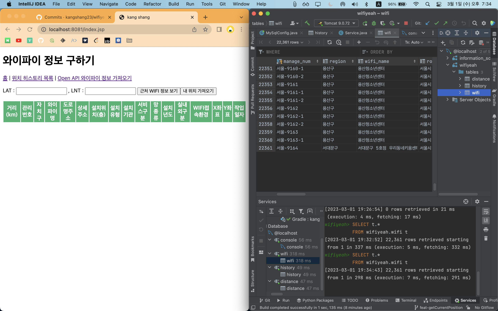
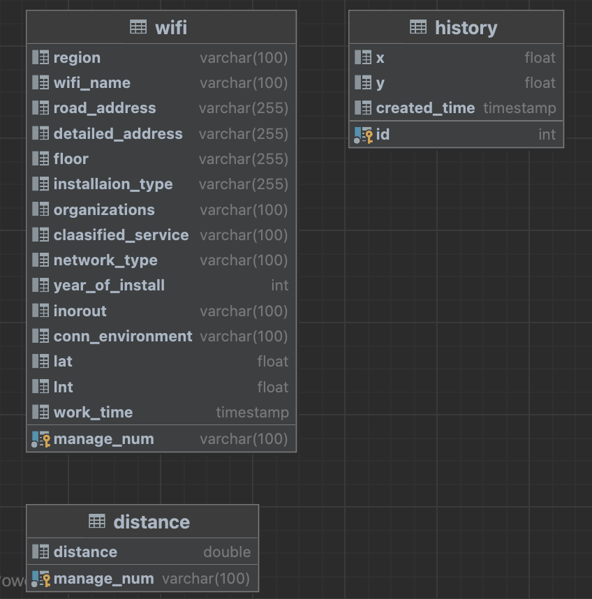

# 내 위치 기반 공공 와이파이 정보를 제공하는 웹서비스 WIFIYEAH


<br><br>

### 📎 개발 환경
|       분야        |           stack           |  
|:---------------:|:-------------------------:|  
|       언어        |     open jdk 11.0.16      |  
|       DB        |  MySQL-Connector 5.1.49   |  
|       빌드툴       |          Gradle           |  
|   Persistence   |           JDBC            |  
|       IDE       |         IntelliJ          |

<br><br>

## 📎 ERD


<br><br>

## 📎 명세
### ◎ Open API 와이파이 정보 가져오기
- 요청
`http://openapi.seoul.go.kr:8088/sample/json/TbPublicWifiInfo/1/5`
- 응답
```json
[
  {
    "TbPublicWifiInfo": {
      "list_total_count": 22361,
      "RESULT": {
        "CODE": "INFO-000",
        "MESSAGE": "정상 처리되었습니다"
      },
      ", ": [
        {
          "X_SWIFI_MGR_NO": "서울-6047-2",
          "X_SWIFI_WRDOFC": "강남구",
          "X_SWIFI_MAIN_NM": "강남장애인복지관",
          "X_SWIFI_ADRES1": "서울시 강남구 개포로 605",
          "X_SWIFI_ADRES2": "강남장애인복지관(옥내6) 지하2층",
          "X_SWIFI_INSTL_FLOOR": "",
          "X_SWIFI_INSTL_TY": "6-3. 복지 - 장애인",
          "X_SWIFI_INSTL_MBY": "디지털뉴딜(LG U+)",
          "X_SWIFI_SVC_SE": "과기부WiFi(복지시설)",
          "X_SWIFI_CMCWR": "인터넷망_뉴딜용",
          "X_SWIFI_CNSTC_YEAR": "2022",
          "X_SWIFI_INOUT_DOOR": "실내",
          "X_SWIFI_REMARS3": "",
          "LAT": "127.07347",
          "LNT": "37.491985",
          "WORK_DTTM": "2023-02-28 10:58:27.0"
        }
      ]
    }
  }
]
```

<br>

### ◎ 근처 와이파이 정보 보기
1. 내 위치 가져오기
- JavaScript `navigator.geolocation` 사용

2. 내 위치 저장
- 요청

  |이름|타입|설명|
  |------|---|---|
  |x|float|사용자의 위도|
  |y|float|사용자의 경도|
  |create_tme|Timestamp|저장 시간|

3. 와이파이와 나 사이의 거리 저장
- 요청

  |이름|타입|설명|
  |------|---|---|
  |lat|float|사용자의 위도|
  |lnt|float|사용자의 경도|

4. 근처 와이파이 조회
- 응답

  | 이름                | 타입        | 설명                  |
  |--------------------|---------------------|-------------|
  | ditance            | float     | 사용자와 공유 와이파이 사이의 거리 |
  | manage_num         | String    | 공유 와이파이 식별자         |
  | region             | String    | 자치구                 |
  | wifi_name          | String    | 와이파이 이름             |
  | road_address       | String    | 도로명주소               |
  | detailed_address   | String    | 상세주소                |
  | floor              | String    | 층                   |
  | installation_type  | String    | 설치 유형               |
  | organization       | String    | 기관                  |
  | classified_service | String    | 서비스 분류              |
  | network_type       | String    | 망 타입                |
  | year_of_install    | int       | 설치 년도               |
  | in_or_out          | String    | 실내/실외               |
  | conn_environment   | String    | 설치 환경               |
  | lat                | float     | 위도                  |
  | lnt                | float     | 경도                  |
  | worktime           | Timestamp | 마이그레이션 시간           |

<br>

### ◎ 위치 히스토리 목록
- 응답

  | 이름  |타입|설명|
  |-----|------|---|
  | id   |Integer|위치 히스토리 식별자|
  | x |float|사용자의 위도|
  | y |float|사용자의 경도|
  | created_time |Timestamp|생성시간|

<br><br>

## 📎 트러블 슈트
<details>
<summary>마이그레이션 반복 시 와이파이 테이블 초기화 🆚업데이트</summary>
<div markdown="1">

</div>
</details>

<details>
<summary>jdbc template</summary>
<div markdown="1">

</div>
</details>

<details>
<summary>jdbc transaction</summary>
<div markdown="1">

</div>
</details>

<details>
<summary>톰캣9, javaEE8, my-sql Connector 버전 -> 스프링부트의 소중함</summary>
<div markdown="1">

</div>
</details>

<details>
<summary>can not find symbol</summary>
<div markdown="1">

</div>
</details>

<details>
<summary>인스턴스 중복값 (distance)</summary>
<div markdown="1">

</div>
</details>

<br><br>

## 📎 아쉬운점
<details>
<summary>테이블 개수 줄이기, dto 내부클래스</summary>
<div markdown="1">

</div>
</details>

<details>
<summary>마이그레이션 시간 단축</summary>
<div markdown="1">


</div>
</details>

<details>
<summary>예외처리</summary>
<div markdown="1">
- jsp의 js에서 예외 발생시 
</div>
</details>

<details>
<summary>테스트</summary>
<div markdown="1">
- log
- 테스트 클래스
</div>
</details>

<details>
<summary>서비스 객체를 나누어 메서드간 결합 끊기</summary>
<div markdown="1">

</div>
</details>

<details>
<summary>히스토리 삭제 jstl</summary>
<div markdown="1">

</div>
</details>

<details>
<summary>북마크</summary>
<div markdown="1">

</div>
</details>

<details>
<summary>프론트</summary>
<div markdown="1">

</div>
</details>


<br><br>

## 📎 배운점
<details>
<summary>서블릿</summary>
<div markdown="1">

</div>
</details>

<details>
<summary>초기화 방식 - 빌더패턴</summary>
<div markdown="1">

</div>
</details>

<details>
<summary>외래키 없이 조인</summary>
<div markdown="1">

</div>
</details>

<details>
<summary>직렬화/역직렬화</summary>
<div markdown="1">

</div>
</details>

<details>
<summary>공부방식</summary>
<div markdown="1">

</div>
</details>